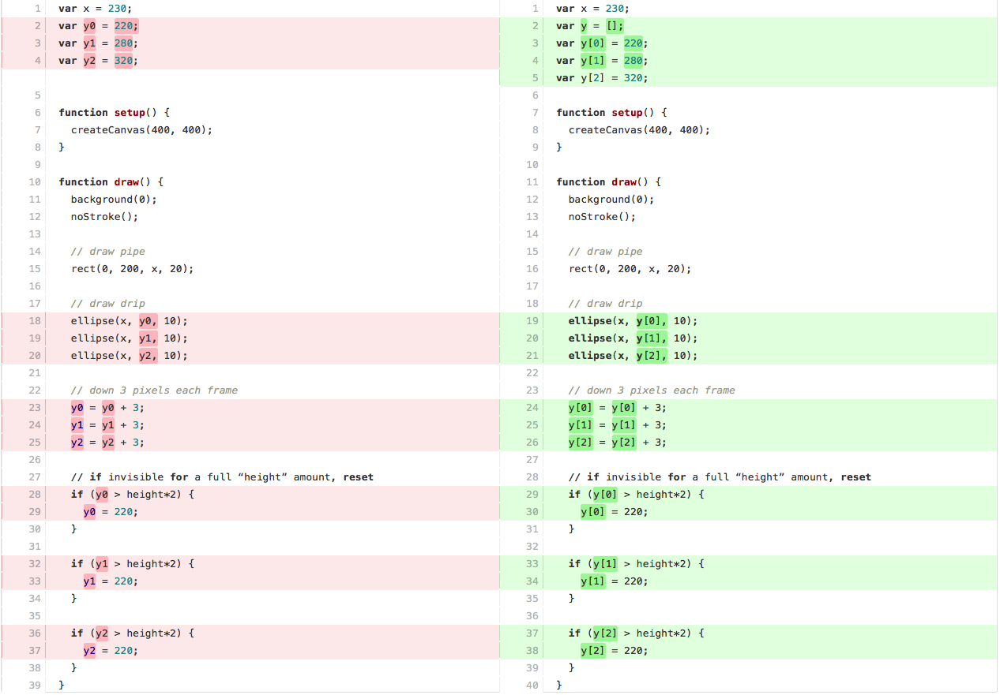
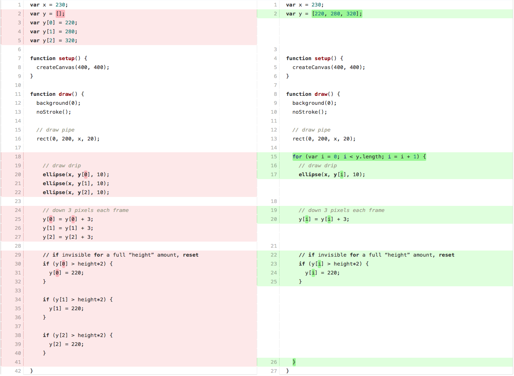

## Homework 3 (due Wednesday, September 26, 2018)

You will be submitting each homework assignment into a new GitHub repository each week. [Here are instructions on how to do so.](https://github.com/zamfi/github-guide/blob/master/README.md) Please [email me](mailto:zamfi@cca.edu) if you have any questions!

### Classwork wrap-up

**Assignment**: In class, you created animations inspired by four example sketches. Post two of your favorites to your homework repository.

If you worked with a partner, you can both submit the same work -- but be sure to note at the top (in a comment, i.e., a line that starts with `//`) who your collaborators were.

### Animation practice

Let's start with this p5.js **Lawn Simulator™**:

```javascript
function setup() {
  createCanvas(400, 200);
  colorMode(HSB, 360, 100, 100, 100);
}

var x = 0;
var h = 10;

function draw() {
  stroke(random(60, 70), 100, 90);
  line(x, height-10, x + random(-10, 10), height-10-random(h));
  
  x = x + 10;
  
  if (x > width) {
    x = random(10);
    h = h + 3;
  }
  
  if (random() > 0.999) {
    noStroke();
    fill(255);
    rect(-1, -1, width+2, height-15);
    h = 10;
  }
  
  noStroke();
  fill(40, 100, 60);
  rect(0, height-10, width, 10);
}
```

Read through and make sure you understand what's going on. In particular:

1. What code draws the blades of grass?
2. What code makes the "lawnmower" come by? How often does it come by?
3. What's the point of the `h` variable?
4. What do the three numerical arguments of `colorMode` do?
5. What does the `-10` do in the second and fourth arguments of the `line` function, `height-10-random(h)`? Why is it there?

**Assignment**: Answer these questions in the `README.md` file in your homework repository.

With those answers in mind, make the following changes:

**Assignment**: Perhaps you prefer a much better maintained lawn. Make the lawnmower come by much more often. Save this in your homework repository as `speedy-lawnmower.js`.

**Assignment**: Of course, because this is a computer, you can make the lawnmower come whenever you want. Use the variable `mouseIsPressed` to make mouse clicks trigger the lawnmower. Save this in your homework repository as `clicky-lawnmower.js`.

**Assignment**: Make the lawnmower come when the grass reaches a pre-determined height. Save this in your homework repository as `height-lawnmower.js`.

**Assignment**: Make it a windy day! Change how the blades of grass are drawn so that they all slant towards the right. Save this in your homework repository as `windy-lawnmower.js`.

**Optional Challenge**: Right now, the grass just **disappears** -- animate the lawnmwer coming through and cutting back the grass. (You might need a bunch of extra variables for this! Remember how you animate a shape moving across the screen.) Save this in your homework repository as `animated-lawnmower.js`.

**Optional Challenge**: Add flowers when the blades of grass reach a certain height. Save this in your homework repository as `flowery-lawnmower.js`.

### Loops, arrays, and other complexity

Watch the following Daniel Shiffman videos about loops and arrays in p5 and JavaScript: [4.1](https://www.youtube.com/watch?v=cnRD9o6odjk&list=PLRqwX-V7Uu6Zy51Q-x9tMWIv9cueOFTFA&index=16), [4.2](https://www.youtube.com/watch?v=1c1_TMdf8b8&list=PLRqwX-V7Uu6Zy51Q-x9tMWIv9cueOFTFA&index=17), [7.1](https://www.youtube.com/watch?v=VIQoUghHSxU&index=24&list=PLRqwX-V7Uu6Zy51Q-x9tMWIv9cueOFTFA), and [7.2](https://www.youtube.com/watch?v=RXWO3mFuW-I&index=25&list=PLRqwX-V7Uu6Zy51Q-x9tMWIv9cueOFTFA).

*Aside: I am looking for a free online resource that contains the same content -- but I'm coming up empty. There is a book out there, [Getting Started with P5.js](https://p5js.org/books/), that covers similar content, and it's available at the [SF public library](https://sfpl.bibliocommons.com/item/show/3201528093). CCA's library doesn't have a copy yet, but I've requested that they purchase it.*

At the end of class, I briefly showed a version of the [Water Dripping code with 3 drips](week3-code/drops1.js):

```javascript
var x = 230;
var y0 = 220;
var y1 = 280;
var y2 = 320;

function setup() {
  createCanvas(400, 400);
}
  
function draw() {
  background(0);
  noStroke();

  // draw pipe
  rect(0, 200, x, 20);
  
  // draw drip
  ellipse(x, y0, 10);
  ellipse(x, y1, 10);
  ellipse(x, y2, 10);
  
  // down 3 pixels each frame, but maybe should be accelerating?
  y0 = y0 + 3
  y1 = y1 + 3
  y2 = y2 + 3
  
  // if invisible for a full “height” amount, reset
  if (y0 > height*2) {
     y0 = 220;
  }

  if (y1 > height*2) {
     y1 = 220;
  }

  if (y2 > height*2) {
     y2 = 220;
  }
}
```

Note that there is a `y` variable for each drop. This isn't too bad for 3 drops. But it would be extremely annoying to do this for 100 drops. Fortunately, there's another way: arrays & loops.

**Arrays (a fancy word for "lists") can store a bunch of numbers in one variable. You access those numbers using another number -- an *index* -- that tells you *which* number you want.**

For example, let's make an array with four numbers in it:

```javascript
var listOfNumbers = [10, 20, 30, 47];
```

We can then access these numbers by **index**, with the first index being `0`:

```javascript
listOfNumbers[0]; // this is 10
listOfNumbers[1]; // this is 20
listOfNumbers[2]; // this is 30
listOfNumbers[3]; // this is 47
```

These now act like any other variable: you can use them to call functions (e.g., `point(listOfNumbers[0], listOfNumbers[1]);`) and you can assign them new values (e.g., `listOfNumbers[0] = listOfNumbers[0] + 3;`). **But you can also use a second variable for the index.** For example:

```javascript
var i = 2;
point(listOfNumbers[i], listOfNumbers[i+1]); // draw a point at (30, 47)
```

See what I did there? I used the variable `i` to access numbers inside the `listOfNumbers`. Since `i` is `2`, `listOfNumbers[i]` is the same as `listOfNumbers[2]`, and `listOfNumbers[i+1]` is the same as `listOfNumbers[3]`.

Here's [a version of Water Dripping that uses arrays instead of many variables](week3-code/drops2.js). Let's take look at the differences between the two programs; the code on the left is the original code, and on the right is the new code:



Wherever I had a `y` variable with a number, e.g., `y0` or `y1`, I now have an array index instead: `y[0]` or `y[1]`.

But this alone isn't useful at all, it just adds extra `[]` characters everywhere. Except now we can use a loop.

**A loop is syntax to get the computer to do the same thing many times.** The most common type of loop is a fixed-length `for` loop, that looks like this:

```javascript
for (var i = 0; i < 10; i = i + 1) {
  print(i);
}
```

This loop above prints the numbers 0 through 9. (Try it! Put that code inside the `setup` function of [a new p5.js sketch](http://editor.p5js.org) and observe what is printed in the console below the code area.) In other words, it repeats the `print(i)` statement 10 times, using a variable `i` that starts at `0`, goes through to `10` and goes up by `+1` each time. (Can you find where each of those numbers shows up in the syntax for the for loop?)

Now, using a loop, I can add as many drips as I want, and it's as simple as adding more numbers to the list -- no other code changes required. In fact, adding numbers to the list isn't even really a "code" change, it's more of a "data" change. (We'll talk about this distinction next week.)

Here's [a version of Water Dripping that uses arrays **and** loops](week3-code/drops3.js). Let's take a look at the differences now:



Notice that we made a single `for` loop, ending at `y.length` -- meaning that the `i` variable goes all the way up to the full length of the `y` array. Inside that loop are:

1. A single `ellipse(x, y[i], 10)` call, not 3 -- the loop ensures that this line gets called **for every element in the array**.
2. A single `y[i] = y[i] + 3;` line, not 3 -- the loop ensures that this line gets called **for every element in the array**.
3. A single `if` statement with condition `y[i] > height*2` and body `y[i] = 220;` -- the loop ensures that this `if` gets called **for every element in the array**.

Now, it's super easy to add more drops: just add more elements to the `y` array.

**Assignment**: Make a 15-drips version of Water Dripping, by adding 12 more numbers in the range 220 to 800 to the `y` array in [this version of Water Dripping](week3-code/drops.js). Make no other changes to the code. Observe what happens. Save this code as `15-drops-dripping.js`.

**Optional Challenge**: Create a new `for` loop that counts up to 40 inside your `setup` function, and use the [`append`](https://p5js.org/reference/#/p5/append) function (once) to add a new number to the `y` array 40 times. Save this code as `40-drops-dripping.js`

**Optional Challenge**: Modify the bouncing circle code from last week's homework assignment, using loops and arrays, to create a sketch with 100 circles bouncing inside the canvas. Save this code as `100-circles.js`.

**Assignment**: In your `README.md` file, answer the following questions about loops and arrays:

1. If an array has 5 elements in it, what are the valid index values for the array? (Hint: what's always the first index value?)
2. What is the difference between a `for` loop and a `while` loop?
3. Use Google or your favorite search website to figure out what the three parts of a `for` loop are called in JavaScript.
4. How does code refer to the number of elements (aka "entries") in an array? (Hint: it shows up in the code you modified!)

### Catching up on some older videos

This last part just needs to be completed before next Friday's class -- no need to do it by Wednesday.

We skipped these two three videos earlier, but now's a good time to catch up. Watch these Daniel Shiffman videos about **objects**, the `map` function, and the `random` function: [2.3](https://www.youtube.com/watch?v=-e5h4IGKZRY&list=PLRqwX-V7Uu6Zy51Q-x9tMWIv9cueOFTFA&index=9), [2.4](https://www.youtube.com/watch?v=nicMAoW6u1g&list=PLRqwX-V7Uu6Zy51Q-x9tMWIv9cueOFTFA&index=10), and [2.5](https://www.youtube.com/watch?v=nfmV2kuQKwA&list=PLRqwX-V7Uu6Zy51Q-x9tMWIv9cueOFTFA&index=11).

Answer these questions in your `README.md` file:

1. What's the point of an object?
2. What's an example of a range you might use for the `map` function?
3. What line of code would give me a random year in the last century?
